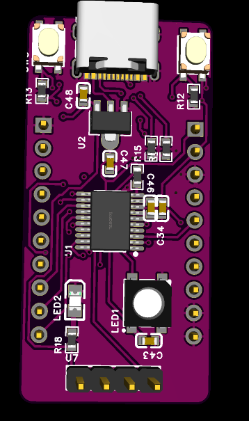
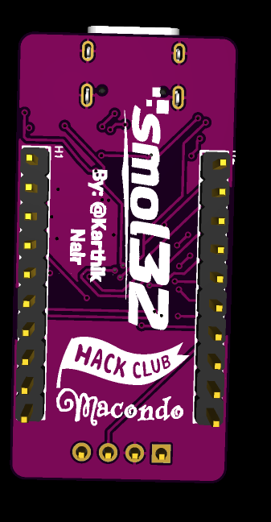
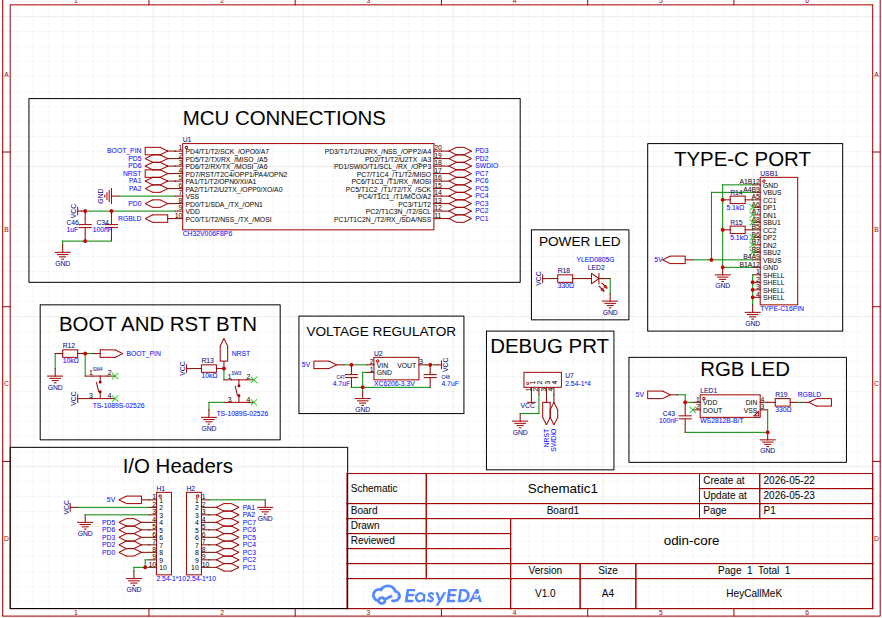
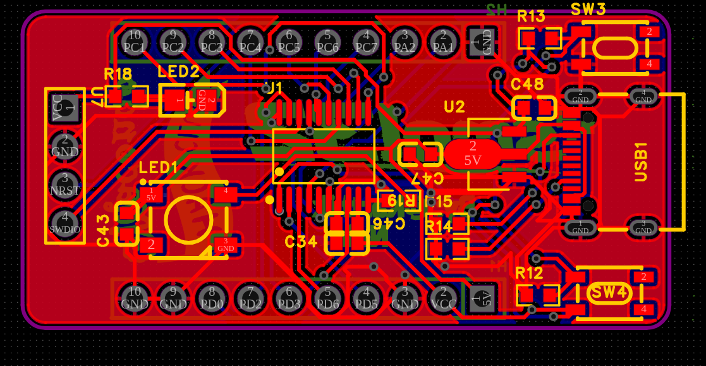
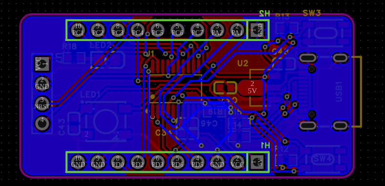

# smol32
# CH32V006 Minimalist Dev Board

A small and powerful mini dev-board powered by a WCH CH32V006F8P6, and also integrates a WS2812B Neopixel.

---

## Pictures

| Top View | Bottom View |
| :---: | :---: |
|  |  |

---

## Features

* **Core MCU:** CH32V006F8P6 RISC-V processor running up to 24MHz and with 8KB Ram.
* **Power Interface:** Native USB-C connector wired for Power Only. 
* **Onboard NeoPixel:** A single integrated WS2812B RGB Smart LED. 
* **Tactile Controls:** Dedicated onboard Reset (RST) and Bootloader (BOOT) hardware buttons.
* **1-Wire Debugging:** Breaks out WCH's proprietary 1-wire Serial Debug Interface (SDI) and NRST for programming via other microcontrollers running Ardulink.

---

## Hardware Architecture & Design Details

### Circuit Schematic Highlights
The schematic design drops external components by utilizing the internal factory-trimmed 24MHz RC oscillator. Key sub-circuits include:
* **Power Regulation:** An XC6206-3.3V LDO step-down regulator takes 5V power from USB-C. It uses twin 4.7µF 0603 ceramic capacitors across VIN and VOUT for high-frequency decoupling and stabilization.
* **USB-C Configuration:** Includes discrete 5.1kΩ pull-down resistors on the CC1 and CC2 channels so modern Type-C to Type-C chargers properly establish 5V sourcing (VBUS).
* **NeoPixel Protection:** The WS2812B is powered cleanly off the raw 5V VBUS line rather than the 3.3V rail. An inline 330Ω resistor sits between MCU Pin 10 (PC0) and the LED's DIN pin to suppress transient voltage spikes.
* **Button Interfaces:** Both the Boot and Reset switches pull directly to GND. Net ports unify the NRST circuit, tying the physical reset button, the MCU's PD7 pin, and the programming header together seamlessly without routing wire clutter across the drawing sheet.

| Circuit Schematic Design |
| :---: |
|  |

### PCB Routing Layout

| PCB Top Layer Routing | PCB Bottom Layer Routing |
| :---: | :---: |
|  |  |

---

## Pinout Configuration

The board breaks out all 20 physical MCU pins directly into standard 2.54mm (0.1") male headers.

### Dedicated Infrastructure Pins
* **Pin 1 (PD4):** Dedicated Bootloader Mode Button 
* **Pin 4 (PD7):** Dedicated Hardware Reset Button & Debug Header Link
* **Pin 7 (VSS):** Ground Plane
* **Pin 9 (VDD):** 3.3V Regulated System Voltage (via XC6206 LDO)
* **Pin 10 (PC0):** WS2812B NeoPixel Data In 

### Available General Purpose IO Pool (14 Pins Free)
The remaining 14 pins are broken out completely unassigned for breadboard prototyping, supporting standard digital IO, ADC analog inputs, UART serial communications, or SPI peripherals.

## License

This hardware project is open-source and proudly distributed under the Apache License 2.0. You are free to copy, modify, distribute, and commercially manufacture this hardware layout. This license provides built-in protection regarding contributor safety, trademark preservation, and implicit patent defense. 

For the complete legal text, please check the accompanying LICENSE file.
